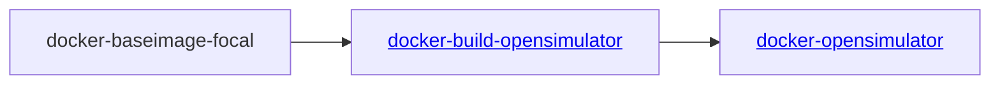

# An Ubuntu docker base image with mono complete

Coming in at approx 752MB I am not so sure this can be called minimal, but it is smaller and more suited than many similar images.

I would prefer to use a much smaller Alpine based image but have not yet done enough testing with mono based builds and applications to use it in production. So for now I continue to use an Ubuntu based image

# Purpose

This image is the image from which we do compile/builds for OpenSimulator.  It is also the image we start from for our OpenSimulator application image creation.

# TL;DR

For those that simply want to build the image and not read everying all you need to do is the following

```bash
git clone https://github.com/mydevlaborg/docker-baseimage-focal.git
cd docker-baseimage-focal
make image
```
You should then have a new image on your computer which can be used freely named ***mydevlab/docker-baseimage-focal:0.0.1***


# Project Reorganization

This project was created as a fork of the original [Phusion baseimage-docker](https://github.com/phusion/baseimage-docker) project. I wanted to retain any history as well as ensure to give them credit for their great work.

Once forked I did some rearranging and cleanup to suit my own needs. I also moved their original license file into the baseimage folder since my modifications to that folder don't substantially change their work. The added README file in that folder better summarizes my modifications, and the git history tracks any actual modifications.

# Overview

This is the first part of a series of related docker projects.



This base image is used in multiple projects I have so is therefore treated as its own separate project rather than being part of a multi-stage Dockerfile.


# Building the Docker Image

I use a Makefile to help handle the build, as an easier way to ensure everything is done in a consistent manner.

Although there are minimal options, basic usage help is available with the following

```bash
make help
```

To build the image simply execute the following

```bash
make image
```

To run a scan for known vulnerabilities on the created image execute the following

```bash
make scan
```